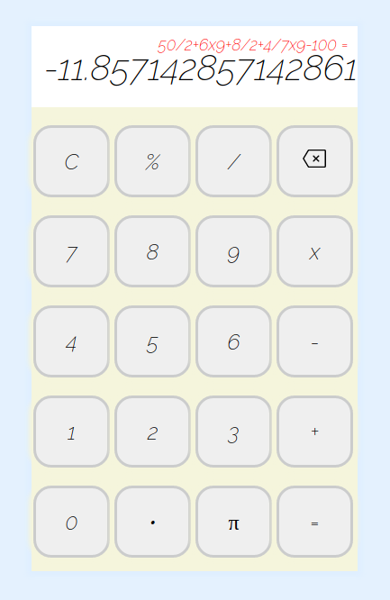

# calculator
A simple calculator web app

Calculator with up to 5 different operations, with one more modulo(%) opertion to be added soon. 

Picture:

[Live Demo] (https://www.genome.gov/)aadim1.github.io/calculator
